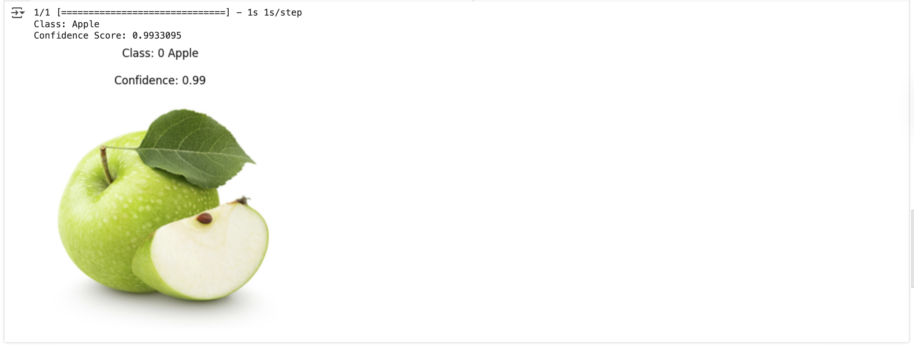

# Teachable-Fruits-Classifier

# 🍎🍊 Apple vs Orange Image Classifier

This is a simple image classification project that distinguishes between **apples** and **oranges** using a pre-trained **Keras model**.

---

## 📂 Dataset

The dataset used for training was sourced from **Kaggle**:  
**Apple vs Orange – Binary Classification Dataset**

It contains labeled images of apples and oranges for binary classification.

---

## 🧠 Model Training

The model was trained using **Teachable Machine by Google**, a tool that simplifies the process of training image classifiers with transfer learning.

### Training Steps:
1. Uploaded sample apple and orange images from the dataset into Teachable Machine.
2. Trained the model using the **"Image Project"** option.
3. Exported the model in **Keras format** (`keras_model.h5`) along with the `labels.txt` file.

---

## 🖼️ Example Output

The model loads an input image and predicts the class (**Apple** or **Orange**) along with a **confidence score**.

  
*Figure 1: Example prediction showing classification result and confidence.*

---

## 🚀 How to Run

Make sure the following files are in your working directory:

- `keras_model.h5` – exported Keras model from Teachable Machine  
- `labels.txt` – class labels  
- A test image (e.g., `test.png`)

### Run the script:
```bash
python classify.py
